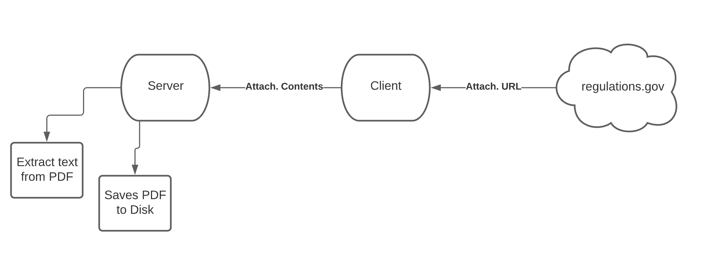

# Experiments

### URL
- https://downloads.regulations.gov/EPA-HQ-OW-2021-0602-0130/attachment_1.pdf
- https://downloads.regulations.gov/HHSIG-2021-0009-0001/content.pdf

### Create and activate Virtual Environment FIRST
- python3 -m venv .venv
- source .venv/bin/activate

### Install dependices
- pip install -r requirements.txt

### To run flask server (try running server first through command line before doing this)
- export FLASK_APP=flask_server.py
- export FLASK_ENV=development
- flask run

### Run server first
- python3 server.py

### Run client in terminal second
- python3 client.py <PDF_URL>

